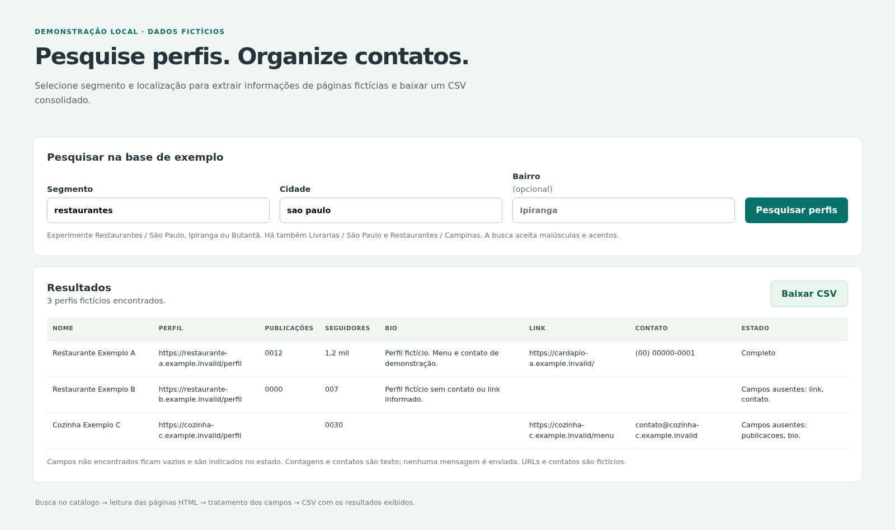

# Pesquisa e organização de perfis comerciais

O projeto nasceu da necessidade de automatizar pesquisas repetitivas de possíveis contatos comerciais e organizar as informações em uma base para análise. Os scripts de janeiro de 2024 pesquisavam perfis por segmento e localização, consultavam páginas e reuniam os campos em CSV. A demonstração local permite experimentar esse fluxo com páginas e contatos inteiramente fictícios.

**Segmento e localização → seleção de perfis → leitura do HTML → extração e tratamento → tabela e CSV.**

## Experimente a demonstração

Requer **Python 3.10 ou superior**, sem instalação de pacotes. Na raiz do projeto:

```bash
python3 app.py
```

Abra **http://127.0.0.1:8000**. Pesquise `Restaurantes` em `São Paulo`; use `Ipiranga` ou `Butantã` para restringir o bairro. Experimente também `Livrarias` em `São Paulo` ou `Restaurantes` em `Campinas`. Caixa e acentos são ignorados, e cada filtro procura um trecho do respectivo campo. Segmento e cidade são obrigatórios; bairro é opcional.



[Baixe o CSV sintético de referência](examples/resultado-sintetico.csv), correspondente a `Restaurantes` / `São Paulo`, sem bairro:

| Nome fictício | Publicações | Seguidores | Contato fictício | Estado |
|---|---|---|---|---|
| Restaurante Exemplo A | `0012` | `1,2 mil` | `(00) 00000-0001` | Completo |
| Restaurante Exemplo B | `0000` | `007` | vazio | Campos ausentes: link, contato. |
| Cozinha Exemplo C | vazio | `0030` | `contato@cozinha-c.example.invalid` | Campos ausentes: publicacoes, bio. |

São **três perfis distintos**: há uma entrada repetida no catálogo, retirada do resultado. Sem correspondência, a tabela fica vazia e o download contém apenas o cabeçalho. Os domínios terminam em `.example.invalid`; os telefones usam DDD `00`, inválido para envio.

O botão **Baixar CSV** entrega o mesmo resultado exibido, incluindo campos vazios. A pesquisa guarda essa saída em memória: após reiniciar o servidor ou expirar o download, refaça a pesquisa. Para usar outra porta, execute `python3 app.py --porta 8001`; encerre com `Ctrl+C`.

## Entradas, processamento e saída

- [demo/catalogo.json](demo/catalogo.json): segmento, cidade, bairro, URL fictícia do perfil e caminho da página. A busca seleciona entradas deste catálogo; ele não contém a tabela final de resultados.
- `demo/perfis/`: cinco páginas HTML fictícias. A extração lê os elementos marcados com `data-campo="nome"`, `"publicacoes"`, `"seguidores"`, `"bio"`, `"link"` e `"contato"`. Para link, lê `href`; para os demais campos, lê o texto.
- `fontes.py`, `extracao.py` e `tratamento.py`: busca, leitura semântica, tratamento e exportação compartilhados. Perfis repetidos são removidos, mantendo a primeira ocorrência; a comparação desconsidera a barra final da URL.
- `app.py` e `demo/tela.html`/`style.css`: tela em português, servida somente em `127.0.0.1`, sem fontes, scripts ou serviços remotos.

O CSV usa **UTF-8 e vírgula**, sem índice adicional. Colunas: `PERFIL`, `NOME`, `PUBLICAÇÕES`, `SEGUIDORES`, `BIO`, `LINK`, `CONTATO`, `SEGMENTO`, `CIDADE`, `BAIRRO`, `ESTADO` e `FONTE`.

Contagens e contatos permanecem **texto**, inclusive zeros à esquerda e abreviações como `1,2 mil`. Campo ausente fica vazio, com indicação em `ESTADO`; `Completo` significa que os seis campos extraídos estão preenchidos, não que os contatos foram verificados. Se não houver contato explícito, o tratamento procura na bio sequências de 8 ou 9 dígitos com separador opcional. Essa expressão não valida DDD ou natureza do número. Nenhuma informação é preenchida por estimativa.

### Modifique os exemplos

Edite uma página em `demo/perfis/` para mudar nome, bio, contagens ou contato; depois refaça a pesquisa. Para outro perfil, copie uma página, use URL `.example.invalid` e acrescente no catálogo `segmento`, `cidade`, `bairro`, `perfil` e `arquivo` relativo a `demo/`. Mantenha todos esses campos textuais; bairro pode ser `""`. O arquivo deve permanecer dentro de `demo/perfis/`.

Remova um elemento `data-campo` para observar um campo ausente. Repita a URL de um perfil no catálogo para observar a deduplicação. Use exclusivamente informações fictícias nas demonstrações e referências versionadas.

O download não cria arquivos no checkout. O CSV em `examples/` é uma referência versionada; editar as páginas muda a próxima pesquisa, sem substituir essa referência. Ao abrir o CSV em uma planilha, importe as colunas como texto para manter zeros e abreviações.

## Coleta externa opcional

`cod.py` e `leads.py` são entradas alternativas para **Google Custom Search JSON API + Selenium/Chrome**. A execução exige `--externo`; importar os módulos ou pedir ajuda não inicia coleta nem carrega requests/Selenium. A tela e o exemplo usam apenas arquivos locais.

Para o modo externo, use ambiente virtual, `requirements-externo.txt`, Chrome e ChromeDriver compatíveis. Copie [config-externa.example.json](config-externa.example.json) para `config-externa.json` e configure URL HTTPS de pesquisa, ID do seu mecanismo, domínio de perfis, caminho do driver e seletores da interface. `nome` e `bio` são obrigatórios na configuração; os demais seletores podem ser omitidos. Cada seletor aceita `por: "css"` ou `"xpath"`, `valor` e, opcionalmente, `atributo`.

```bash
python3 -m venv .venv
source .venv/bin/activate
python -m pip install -r requirements-externo.txt
cp config-externa.example.json config-externa.json
# Edite config-externa.json antes de continuar.
export GOOGLE_API_KEY='SUA_CHAVE_PROPRIA'
python3 cod.py --externo --config config-externa.json \
  --segmento Restaurantes --cidade "São Paulo" --bairro Ipiranga \
  --max-resultados 10 --saida outputs/coleta-01.csv
```

A chave é lida do ambiente, sem carregamento automático de `.env`. Configuração ausente/incompatível interrompe antes de iniciar a coleta. `timeout_http`, `timeout_pagina` e `pausa_segundos` podem ser definidos no JSON. Padrões de `cod.py`: 15 s, 35 s e 10 s; de `leads.py`: 15 s, 50 s e 40 s.

A consulta combina os filtros e o domínio configurado, pagina os resultados, abre os perfis em **um único navegador** e fecha o driver ao encerrar. Requisições HTTP e carregamento das páginas têm timeout. A saída contém estado da extração e usa caminho novo, sem sobrescrever arquivo existente. Os filtros do mecanismo externo dependem dos resultados do serviço; não têm a mesma seleção determinística do catálogo fictício.

Para tratar separadamente um CSV local, use `python3 tratamento.py --entrada entrada.csv --saida outputs/tratado-01.csv`. Aceita o formato atual ou o histórico com `IG`, `NOME`, `N° PUBLICAÇÕES`, `N° SEGUIDORES`, `BIO` e `LINK DA BIO`; gera o esquema atual e preserva a entrada.

### Limites técnicos

Os seletores externos dependem da interface consultada: configurar outra URL não torna o extrator universal. Classes e estrutura de páginas podem mudar; o arquivo de exemplo contém placeholders para adaptação. A API exige acesso, mecanismo próprio e observação de suas cotas. Não habilite logs de requisições completas com a chave.

A demonstração não abre perfis remotos nem envia mensagens. Disponibilidade de um perfil externo não define permissão de uso de seus dados; armazenamento e compartilhamento devem considerar o contexto de coleta. O projeto não verifica identidade, disponibilidade ou capacidade de contato dos perfis.

## Verificações locais

```bash
python3 -B -m unittest discover -s tests -v
```

As verificações usam somente dados fictícios e localhost: filtros, extração de páginas, campos vazios, duplicidades, preservação textual, CSV, importação sem automação e download correspondente à tabela.
